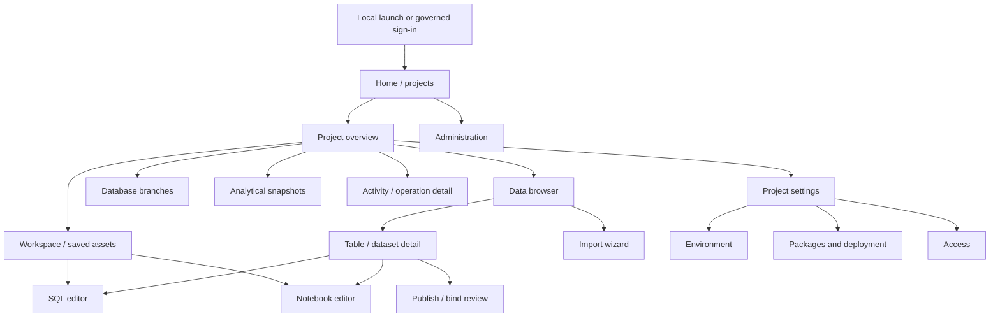

# Console page structure

[Product documentation](README.md) · [Jobs](jobs-to-be-done.md) ·
[User flows](user-flows.md) · [Interactive wireframes](wireframes/README.md)

Proposed structure, 2026-09-22. These pages organize the delivered capabilities
and identify product/API work needed for the next console. Routes below are
design contracts, not existing backend endpoints. The wireframe uses hash-based
screen links and synthetic data, independently of the live console.

## Navigation hierarchy

The application has three levels: installation home, project working context,
and an open asset or operation. Project settings is a navigation group, not a
generic landing page. SQL and notebooks are asset editors, with quick-create links
in the rail; they do not each own a competing project hierarchy.

There is no new backend workspace object. The **Workspace** page is the project's
saved source browser. Database branches and analytical snapshots are distinct
destinations; neither is a Git branch or a scheduled pipeline.

## Shared shell

| Region | Structure and responsibility |
| --- | --- |
| Installation rail | Supabricks / instance label; Home; project selector; selected project's working destinations; settings group; authorized Administration |
| Top bar | Breadcrumb to the current asset, scoped search, identity/profile and connection state. Search begins with available project assets; broader search requires a contract. |
| Page header | Resource name, short context and one primary action. Secondary actions use a compact toolbar. |
| Working area | Lists/details for browsing; tree/editor/results for authoring; a focused step sequence for consequential changes. |
| Context strip | Engine, branch, data version and environment at the point of execution. Identity is visible in governed mode. |
| Inspector / drawer | Secondary provenance, operation stages, review summaries and diagnostics. Critical input choices stay in the main task. |
| Feedback | Field-level errors, page-level service failures and persistent operation state. Toasts acknowledge actions but do not carry the only copy of a result. |

Local and governed modes share task names and layout grammar, while authorization,
data selection and available controls follow their separate platform contracts.
Administration and multi-user Access appear only when advertised and authorized.
A reader cannot gain rights by selecting a page, role or URL. The prototype's
profile selector is a reviewer control outside the product shell.

## Page inventory and ownership

Stable WF IDs map directly to screens in the interactive wireframe. ID parameters
in proposed routes are opaque identifiers, never names alone or credentials.

| Screen | Proposed route | Content hierarchy and primary action | Flows |
| --- | --- | --- | --- |
| WF-01 Entry | `/sign-in` | Instance, configured sign-in path, connection help. Primary: Sign in; local mode requests a fresh launch link. | UF-01 |
| WF-02 Home | `/` | Accessible projects, recent authorized assets, setup/empty guidance. Primary: New project when allowed. | UF-01, UF-02 |
| WF-03 Project overview | `/projects/:project` | Project purpose, main branch and service readiness, recent work, next-step actions. Primary: Open workspace. | UF-02, UF-13 |
| WF-04 Workspace | `/projects/:project/workspace` | Asset tree, type/name filters, saved queries/notebooks, saved revision and owner. Primary: New asset. | UF-01, UF-05, UF-08, UF-14 |
| WF-05 Data browser | `/projects/:project/data` | Scope tabs for live tables, published snapshots and accessible catalog data; filter/list; ownership and freshness. Primary: Import file. | UF-03, UF-04 |
| WF-06 Table / dataset | `/projects/:project/data/:asset` | Identity and live/snapshot label; schema/sample/provenance tabs; access-aware handoffs. Primary: Open in SQL; Notebook and publication/binding are secondary. | UF-04, UF-05, UF-08, UF-10 |
| WF-07 SQL editor | `/projects/:project/queries/:query` | Asset tabs and schema explorer; explicit engine/inputs; editor; result/status panels. Primary: Run. Save is separate. | UF-05 |
| WF-08 Notebook editor | `/projects/:project/notebooks/:notebook` | Asset tabs; input/environment strip; kernel status; cells/outputs; save state. Primary: Start kernel or Run, according to state. | UF-08, UF-09, UF-14 |
| WF-09 Import | `/projects/:project/imports/new` | Choose file → interpret/map → review destination → operation/result. Primary: next step, then Import. | UF-03 |
| WF-10 Branches | `/projects/:project/branches` | Branch list with parent/readiness; selected branch detail; scoped create/open/suspend/delete controls. Primary: Create branch. | UF-06 |
| WF-11 Snapshots | `/projects/:project/snapshots` | Live source versus latest available versus active session input; refresh activity; versions. Primary: Refresh snapshot. | UF-07 |
| WF-12 Environment | `/projects/:project/settings/environment` | Declared/prepared/running versions; dependency list; preparation history; adoption review. Primary: Prepare changes, then Adopt when appropriate. | UF-09 |
| WF-13 Publication / binding | `/projects/:project/data/publications/:publication` | Producer/consumer context; complete table set; target namespace or logical binding; revision-fenced review. Primary: Review, then confirm publish/bind. | UF-10 |
| WF-14 Packages | `/projects/:project/settings/packages` | Export choices or inspect imported package; destination binding; plan; operation and installed source. Primary: Review export or Review apply. | UF-11, UF-14 |
| WF-15 Activity | `/projects/:project/activity/:operation?` | Authorized current/recent operations; selected operation stages, diagnostics and supported cancel/recovery actions. Primary action is state-dependent. | UF-13 |
| WF-16 Access | `/projects/:project/settings/access` | Separate project/data/execution permission categories; principal/resource selection; direct/inherited origins; reviewed change. Primary: Review access change. | UF-12 |
| WF-17 Administration | `/admin/:section` | Identity, catalog grants, audit and service health; operator-only navigation and scoped evidence. Primary action depends on section. | UF-12, UF-13 |

New query/notebook routes allocate an unsaved draft in design; do not imply an
existing durable draft API. Saving assigns or resolves the real asset identity.
Query inputs and editor text belong to explicit state, not secret-bearing URL
parameters. Operation routes restore the original operation rather than resubmit it.

## Core page compositions

**Browse → inspect → act.** Home, Workspace, Data and Branches start with a
scannable list. Selection opens details without discarding filter/scroll context.
Large data samples are bounded; full names remain accessible even when truncated.
The data detail page explains source/freshness before offering execution.

**Author → execute → inspect.** SQL and notebooks use the same shell and asset-tab
placement. SQL has a schema explorer and result pane; notebooks prioritize the
document. Input context remains visible while scrolling. Editing/saving source,
running work and selecting a new environment/data version remain distinct actions.

**Prepare → review → commit → follow.** Import, publication/binding, packages and
access changes use a focused sequence. Review shows actual consequences and exact
target context, not serialized API input. When inputs/policy change, invalidate
the review and obtain a new one. Successful submission leads to a durable outcome.

**Observe → recover.** Activity and administration place the affected resource,
authoritative state and next safe action ahead of logs. A timeout may mean unknown
outcome; it never automatically means "retry the write." Historical and current
results are labelled separately.

## Supporting overlays

| Surface | Use | Exit and persistence |
| --- | --- | --- |
| New project / branch dialog | A short scoped name/context form | Cancel keeps existing context; successful creation links to the new resource |
| Scoped search dialog | Find a permitted project asset | Escape closes; choosing a result opens its authorized route |
| Review dialog / panel | Confirm target and consequences for a bounded change | Stale review cannot submit; cancel returns to editable inputs |
| Save / conflict dialog | Name source or resolve a revision conflict | Keep editing, save a copy or explicit discard; never silent overwrite |
| Operation inspector | View ongoing work while retaining the task page | Closing inspector does not cancel the operation |

Use a page rather than a modal for multi-stage imports, package plans and other
tasks users may need to resume. Dialogs trap focus, support Escape and return focus
to their trigger. Destructive confirmations identify the affected resource.

## State and navigation contracts

| State | Structure and next step |
| --- | --- |
| Loading | Keep shell and known context; skeletons only for unknown content; announce loading |
| Empty | Explain the scope; offer the one useful next step; do not show invented rows |
| Unavailable service | Retain safe input; identify affected operation; retry reads or link to recovery |
| No permission / missing resource | Non-disclosing explanation; return to permitted context; no names or previous cached data |
| Partial or unknown outcome | Show last confirmed stage and operation ID; reconcile before a new mutation |
| Dirty asset | Visible unsaved indicator; guarded navigation and explicit save/discard; no automatic persistence of sensitive content |
| Revoked / signed out | Close streams and clear protected content; follow the governed authentication contract |

Back/forward navigation should restore a page's non-sensitive filters and selected
asset only after authorization. It must never replay Run/Import/Apply. Changing
project restores that project's own context; it does not carry data inputs or
credentials from the previous project. Opening a notebook never executes cells.

Desktop is the primary authoring surface (1280–1600 px). Below 1000 px, collapse
the rail and move inspectors below the main content. On narrow screens use one
working column with contained horizontal scrolling for code and tables. Preserve
task actions, keyboard access, focus and status; do not attempt a compressed
three-pane editor. Mobile authoring support needs a separate usability decision.

## Wireframe review scope

The [wireframe gallery](wireframes/README.md) renders all 17 compositions, two
profiles and five page states. It links the primary authoring, catalog and
administration journeys and includes sample reviews and editor interactions.
It is an information-architecture prototype: synthetic content, no API requests,
no real permissions, no persistence and no runtime operations.

Stable routing, recents, unified search, persistent asset tabs/drafts, activity
aggregation and readable effective-access summaries require frontend/platform
contracts before implementation. Scheduling, dashboards, ML, public sharing and
real-time coauthoring remain outside this wireframe set.

Review questions: Can a new user find the next action? Is project/branch/data
version unambiguous? Do reviews explain consequences? Can a returning user find
saved work? Are state-specific recovery actions understandable? Validate those
before selecting visual branding or a component library.
