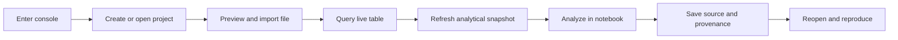
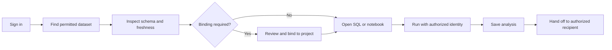

# Console user flows

[Product documentation](README.md) · [Jobs to be done](jobs-to-be-done.md) ·
[Current state and source map](current-state.md)

These are target product flows, not descriptions of every current screen.
Each flow identifies the delivered foundation and additional design/API work.
All UI actions remain subject to the server's profile, capability and permission
checks. IDs are stable references for prototypes, implementation slices and tests.

## Flow index

| Flow | Job | Intended outcome | Foundation / dependency |
| --- | --- | --- | --- |
| UF-01 Enter or resume | JTBD-01 | Correct identity, project and working context | Existing launch/login; shared shell and durable restoration proposed |
| UF-02 Create/open project | JTBD-01 | A ready project or recoverable setup operation | Existing creation/opening; profile-aware guided experience |
| UF-03 Import file | JTBD-02 | New table and verified first query | Existing ingestion; improve interpretation, progress and handoff |
| UF-04 Discover data | JTBD-03 | Informed selection and permitted editor handoff | Existing catalog/workspace; integrated discovery proposed |
| UF-05 SQL | JTBD-04 | Result and saved query with context | Existing SQL; unify authoring and define durable drafts/history |
| UF-06 Branch experiment | JTBD-05 | Independent experiment with explicit target | Existing branch APIs; improve editor/context transitions |
| UF-07 Snapshot | JTBD-06 | Deliberately selected analytical data version | Existing refresh and pinned sessions; clarify freshness |
| UF-08 Notebook | JTBD-07 | Saved, reproducible analysis | Existing kernels/files; align local/governed authoring quality |
| UF-09 Environment | JTBD-08 | Prepared dependencies explicitly adopted | Existing managed environments; capability-dependent controls |
| UF-10 Publish/consume | JTBD-09 | Cross-project use of a reviewed dataset revision | Existing publication and bindings; guided producer/consumer path |
| UF-11 Package/apply | JTBD-10 | Verified destination project | Existing packages/deployments; improve review and recovery |
| UF-12 Access | JTBD-11 | Correct effective access and visible revocation | Existing governed APIs; readable policy forms/review |
| UF-13 Activity/recovery | JTBD-12 | Known operation outcome and safe continuation | Existing operation status; aggregate history/operator UI needs design |
| UF-14 Handoff | JTBD-13 | Recipient can inspect/reproduce authorized work | Existing saves/exports; stable governed asset links need a contract |
| UF-15 Automation | JTBD-14 | Repeatable unattended execution | Future platform/product work; not an interactive-run feature |

## Two primary journeys

## Rules shared by every flow

**Context.** Persistent navigation identifies installation/profile and project.
Editors identify branch, engine, analytical version and effective identity where
applicable. Changing a project or branch never silently retargets a running query
or kernel. Remember UI preferences separately from authorization and operation state.

**Navigation.** Proposed stable asset routes use non-secret identifiers. A route
is a locator, not a grant. Opening it resolves current permissions before loading
content. Back/forward navigation and view changes preserve valid work; the exact
draft persistence mechanism needs an explicit storage/privacy design.

**State.** Every operation distinguishes loading, empty, ready, submitting,
running, succeeded, failed and unavailable as applicable. Supported cancellation
adds cancellation-requested and cancelled states. Unknown outcome after a timeout
is not failure: reconcile the original operation before allowing a new mutation.

**Permissions.** Show reasons for unavailable actions only on resources the user
is entitled to see. Inaccessible/deleted deep links use a neutral response that
does not confirm hidden resource existence. Local-owner screens do not pretend
to enforce governed tenant isolation. Never fall back to local-owner authority.

**Unsaved work.** State clearly what is saved and where. Offer save, keep editing
or explicit discard before destructive navigation. On logout/revocation, clear
protected content and do not persist it into another user's session. Any proposed
draft recovery across login must be bound to the same identity and reauthorization;
confidentiality takes precedence over retaining a browser cache.

**Accessibility and feedback.** All actions work with a keyboard and visible
focus. Dialogs have labelled controls, managed focus and return focus on close.
Announce state changes without moving focus unexpectedly. Errors name the affected
input and next action; detailed diagnostics are secondary, never the primary UI.
Use progress stages when percentages cannot be measured. Bounded lists and results
must remain usable without rendering an unbounded table.

## UF-01 — Enter or resume

**Job:** JTBD-01. **Entry:** local launch, governed server URL, or a proposed saved
asset link. **Precondition:** a reachable installation; governed users need a
configured identity provider and authorized identity.

1. Local launch exchanges its one-use token for a browser session and removes the
   token from navigation. Governed entry uses the configured sign-in flow.
2. Show the current profile and identity, then accessible projects or the requested
   asset. No accessible projects is an intentional empty state, not a network error.
3. Offer create/open actions allowed by that profile. Returning users can choose
   a recent asset once authorized recents are implemented.
4. Resolve its project, saved revision and target context. Open without running
   code or starting an unnecessary kernel.

**Recovery:** an expired local launch explains how to obtain a fresh link; an
expired governed session offers sign-in. Provider outage must not switch identity
mode. A removed project or revoked route returns a non-disclosing unavailable
state. Lost connectivity preserves only content that may remain visible under
the current session rules.

**Done:** user can identify where and as whom they are working. **New work:**
shared shell, stable asset routes, permission-filtered recents and safe restoration.

## UF-02 — Create or open a project

**Job:** JTBD-01. **Entry:** Home → New project or project picker.
**Precondition:** create/open authority; governed creation follows the server's
actual administrator policy, not a persona assumption.

1. Choose create or open. For creation, enter a name with inline validation;
   explain that setup includes the project's database where supported.
2. Show destination/profile only where the user must make a meaningful choice.
   Ordinary local setup should not ask for internal deployment IDs or directories.
3. Submit once, show durable setup stages and retain the setup identifier.
4. When ready, select the project and main database. Offer Import data, Explore
   data and New query/notebook as context-appropriate next actions.

**Recovery:** invalid/duplicate names are fixable in place. A reload reconnects to
the same setup. Partial failure offers Continue setup/Retry where supported;
it must not create a second project. Opening a source package routes to UF-11.

**Done:** project ownership and selected database are visible, and setup has a
known outcome. **Foundation:** existing project creation and opening; presentation
and recovery parity across profiles require design.

## UF-03 — Import a file

**Job:** JTBD-02. **Entry:** project empty state, Data → Import, or an editor action.
**Precondition:** selected project/branch, write/import authority, supported file.

1. Select a CSV/TSV, JSON/JSONL/document or Parquet file. Explain accepted types
   and runtime-provided limits before uploading.
2. Preview the parser's interpretation, sample rows, column names/types and mapping.
   Show warnings at the affected columns or records, with supported corrections.
3. Choose a new table name and review the branch, destination and schema. Do not
   present overwrite as the default import behavior.
4. Approve and submit. Show staging/import/finalization state from the operation,
   and cancellation only at stages the backend supports.
5. Open the completed table with actual row outcome and a bounded preview. Offer
   Query live table or Prepare analytical snapshot.

**Recovery:** malformed input and name conflicts return to the preserved review.
After connectivity loss, reconcile by operation ID before a retry. Partial or
uncertain commit outcomes must be explicit. An import completed in the background
remains discoverable even when the originating view has closed.

**Done:** UF-05 verifies the imported data. **Foundation:** importer and durable
ingestion already exist; unify completion handoffs and status language.

## UF-04 — Discover and inspect data

**Job:** JTBD-03. **Entry:** Data, a known table, or proposed search.
**Precondition:** metadata authority; reading samples may require separate access.

1. Choose scope: live branch tables, published project data or accessible catalog
   datasets. Retain filters and make their scope clear.
2. Select an asset. Show schema, owner/project, source, live/snapshot classification,
   publication/version and freshness information available from the backend.
3. Request a bounded sample only when authorized. Empty data, denied sampling and
   loading failure must appear as different states.
4. Choose Open in SQL, Open in notebook, or Review binding. Carry the selected
   asset and input version into the next flow without granting additional access.

**Recovery:** a missing/recreated provider object requires reconciliation, not
automatic substitution by name. If metadata is readable but rows are not, explain
the permitted access path; do not expose hidden assets in search suggestions.

**Done:** the user understands the input and reaches UF-05, UF-08 or UF-10.
**New work:** consistent details/handoff and broader search contracts; no general
lineage graph or request-access ticket service is assumed.

## UF-05 — Author and run SQL

**Job:** JTBD-04. **Entry:** New query, saved query, table action or dataset handoff.
**Precondition:** allowed engine/data execution and an explicit target.

1. Open an editor with the project, engine and branch/data binding visible.
   PostgreSQL means live data; Spark SQL means a selected analytical snapshot.
2. Write or edit SQL. Schema exploration assists authoring without replacing the
   draft. New tabs inherit explicit context, not whichever session ran most recently.
3. Run deliberately. PostgreSQL writes require the supported write mode/authority;
   Spark SQL remains read-only. A failed run preserves source.
4. Inspect columns, rows, duration and available diagnostics. Label truncation and
   bounded samples. Expose cancellation and its confirmed outcome.
5. Name and save the query under the project. If its backend contract cannot retain
   execution context, identify that gap before promising it in the save UI.

**Recovery:** preserve SQL after syntax, permission and session errors. Resolve
stale resource revisions before retrying writes. Do not silently switch SQL
dialects. A tab closing during execution offers clear detach/cancel choices only
where the server supports them; it does not imply automatic cancellation.

**Done:** user can reopen the saved query and deliberately run it against a known
target. **New work:** consistent authoring across profiles, durable drafts and
cross-session history; current local query tabs/saved queries are a foundation.

## UF-06 — Experiment on a database branch

**Job:** JTBD-05. **Entry:** branch picker or database actions.
**Precondition:** branch-create authority and an existing source branch.

1. Select the source branch and enter an experiment name. Review the source and
   supported lifecycle options.
2. Create and wait for readiness. Existing editors keep their current target.
3. Explicitly open a query on the new branch; its identity stays visible near Run.
4. Apply a test change, inspect results and return to the source branch to compare.
5. Keep, suspend or delete the experiment using supported actions. Deletion shows
   affected work and dependencies before confirmation.

**Recovery:** handle duplicate names, expired branches and stale revisions without
retargeting execution. A blocked deletion explains the dependency or permission.
There is no implicit merge/promotion action.

**Done:** experiment changes only its branch; original context remains recoverable.
**Foundation:** branching exists; improve state, context and cleanup presentation.

## UF-07 — Refresh and select an analytical snapshot

**Job:** JTBD-06. **Entry:** Spark SQL, notebook inputs or Data → snapshot details.
**Precondition:** refresh authority on a source branch or read authority on an
existing usable publication.

1. Show current live source, latest available snapshot and the active session's
   selected version. Distinguish no snapshot from a failed service.
2. If permitted, request refresh and show export/publication stages. Explain that
   this prepares a consistent analytical version, not continuous synchronization.
3. On completion, display the newly available version, scope and unsupported or
   omitted relations reported by the runtime.
4. Offer Open new session / Restart with this snapshot as supported. Existing
   sessions retain their previous inputs until an explicit change.
5. Run analysis and retain the selected version with its result provenance.

**Recovery:** failed/cancelled refresh leaves a previous valid snapshot visible.
A newer publication arriving during review requires a fresh selection; do not
silently substitute it. Permission changes and unavailable inputs stop admission.

**Done:** the user can explain the version used. **Foundation:** refresh, immutable
epochs and pinned sessions exist; unify the live/latest/active version distinction.

## UF-08 — Create, run and resume a notebook

**Job:** JTBD-07. **Entry:** project asset browser, Data handoff or New notebook.
**Precondition:** source access plus separate execution/data authority when running.

1. Create/open the notebook without executing it. Show saved name/revision and
   dirty state; inherited historical outputs remain labelled as such.
2. Select branch or dataset bindings and environment. Present a concise summary
   before starting; expose exact provenance through details.
3. Start execution and show preparing → starting → ready or an actionable failure.
   Capacity denial is not an indefinite queue unless a queue contract exists.
4. Edit and run cells; show busy, output, error and interrupted states. Interrupt
   and restart explain their different effects on in-memory variables.
5. Save source explicitly, with clear output persistence behavior. Stop execution
   when desired; keeping a saved notebook does not require a running kernel.
6. Reopen later, inspect recorded inputs and deliberately choose reproduction or
   new inputs. Starting a fresh kernel must not imply prior in-memory state exists.

**Recovery:** on file revision conflict, offer compare/copy or another supported
non-destructive route rather than overwrite. Runtime loss preserves authorized
edits and marks outputs appropriately. Governed revocation closes streams and
clears protected content according to the authentication contract.

**Done:** source can be reopened and deliberately reproduced; kernel lifecycle
is known. **New work:** consistent multi-asset authoring and save/recovery UX across
profiles; retain current Jupyter and governed execution correctness tests.

## UF-09 — Prepare and adopt an environment

**Job:** JTBD-08. **Entry:** notebook dependency controls or project environment.
**Precondition:** environment capability/authority and a supported package source.

1. Display declared dependencies, prepared version and the active kernel version.
2. Edit supported dependency declarations or select a qualified offline bundle.
   Review changes before preparation.
3. Prepare and show resolution/install/verification state from the platform.
   Keep the current working environment usable while this operation proceeds.
4. Once ready, explicitly adopt/restart. Warn about lost kernel variables and
   record the new environment with subsequent executions.
5. Verify the required import and save the dependency declaration with project work.

**Recovery:** unsupported package, network policy, lock conflict or failed build
returns to a fixable declaration without pretending the kernel changed. Stale
project source requires a refreshed preparation review. Governed policies may
restrict this path; local package controls are not automatically available there.

**Done:** declared/prepared/running versions align by explicit choice.
**Foundation:** existing managed environments; profile-specific affordances and
progress feedback need product design.

## UF-10 — Publish and consume across projects

**Job:** JTBD-09. **Entry:** producer Data → Publish, consumer Data → Bind dataset.
**Precondition:** publication/binding authority and separately authorized data use.

1. Producer selects a completed snapshot, reviews the complete table set, owning
   project and intended catalog location, then publishes the reviewed revision.
2. Show publication outcome and provenance. Visibility is governed by existing
   access rules; publishing does not grant everyone data access.
3. Consumer discovers the permitted publication and selects its own destination
   project and logical binding name.
4. Review the publication identity/revision, tables and destination changes; apply
   the binding using the current source/policy revisions.
5. Open SQL or a notebook against that binding. When a newer publication exists,
   review a binding update; active sessions keep their original inputs.

**Recovery:** stale previews/grants need re-review; provider failure cannot create
an optimistic success. Withdrawal prevents new use according to the contract and
explains retained references/readers. Do not replace dropped/recreated datasets
merely because names match.

**Done:** a second project reads the reviewed revision without taking ownership.
**Foundation:** durable publication and binding workflows; improve their continuity.

## UF-11 — Package, import and apply a project

**Job:** JTBD-10. **Entry:** project → Export or Home/project → Import package.
**Precondition:** source/data export or destination apply authority as appropriate.

1. Choose source, supported offline dependencies and optional logical data
   separately. Explain included and excluded material; secrets/grants do not travel.
2. Inspect and export the reviewed package. Report verification and target limits.
3. At the destination, inspect before applying. Choose/create the project binding
   and resolve required datasets and environments explicitly.
4. Show a readable plan of creates, retained resources, migrations and explicit
   fixture/data loads. Apply only the reviewed current plan.
5. Follow the durable operation. Open the installed revision, show unresolved
   requirements, and run an explicit verification query/notebook if authorized.

**Recovery:** corrupted/incompatible archives fail before mutation. Stale plans
must be regenerated; interrupted apply reconnects to the same operation. Keep
retained resources visible. Source edits after installation require the supported
fork/edit workflow, not silently changing immutable installed source.

**Done:** destination work is usable and its remaining prerequisites are explicit.
**Foundation:** packaging, deployment bindings and apply exist; simplify forms and
review language without hiding consequential differences.

## UF-12 — Grant, review and revoke access

**Job:** JTBD-11. **Entry:** governed project Access, catalog administration or
authorized identity administration. **Precondition:** authority for that policy area.

1. Select a known principal/group/service identity and resource. Display current
   direct and inherited access where the API supplies that information.
2. Choose a specific permission category: project role, execution/service use,
   PostgreSQL data access or catalog grant. Explain what it does and does not allow.
3. Review a before/after summary, effective identity and relevant revision. If the
   runtime cannot prove effective access, report uncertainty rather than invent it.
4. Apply through the governed API and display its confirmed outcome/audit reference.
5. For revocation/disable, show the affected scope and convergence state. Explain
   overlap with other grants and any project-wide fencing of running executions.

**Recovery:** stale policy, provider drift, partial remote effect or audit failure
prevents a success claim; expose supported reconciliation. Revoked users cannot
continue through existing streams or cached controls. Check behavior using a
separate authorized test identity; no impersonation feature is assumed.

**Done:** actual permitted access and the recorded outcome match the review.
**New work:** clear forms and policy summaries over existing governed contracts.
Local-owner mode does not display decorative multi-user controls.

## UF-13 — Monitor, cancel and recover work

**Job:** JTBD-12. **Entry:** operation indicator, editor status, proposed Activity
view or authorized operator health view.

1. Open the operation with its project, actor if visible, affected resource, start
   time, state and available diagnostics. Permission-filter the list and details.
2. Inspect meaningful stages; use counts/progress only when measured. Show which
   results are current and which are stale or incomplete.
3. Cancel if supported. Show cancellation requested until confirmed; closing the
   browser is not cancellation.
4. After failure or disconnect, reconcile the original operation and offer the
   backend's safe continue/retry/edit-input action.
5. On completion, navigate to the result or original work. Operators can follow a
   scoped runbook for service recovery or stopped backup/restore.

**Recovery:** a client timeout reports outcome unknown while checking status.
Quota/capacity failures explain how to free capacity; there is no implicit queue.
Service failures affect only relevant work where the runtime permits continued
operation. Logs are redacted and downloadable only with appropriate authority.

**Done:** known terminal outcome or a clear, actionable operator handoff.
**New work:** unified activity/history and operator health UI require API and
retention review. Existing per-operation state is not a durable global run history.
Backup/restore can link to the supported runbook until a separate browser contract exists.

## UF-14 — Hand off an analysis

**Job:** JTBD-13. **Entry:** saved query/notebook or project export.
**Precondition:** saved source revision and authority to export/share its content.

1. Save work and identify its data/environment inputs. Decide whether outputs
   should travel using supported source/package behavior.
2. For local handoff, export the notebook/project and use UF-11 at the destination.
   Source export alone does not promise that data or dependencies are included.
3. For a future governed asset link, copy a stable, non-secret locator. Resolve
   recipient authority independently; access changes go through UF-12.
4. Recipient opens the intended saved revision, sees historical output labels and
   missing inputs/permissions, and chooses whether to execute as themselves or an
   explicitly permitted service identity.

**Recovery:** unavailable data, environment or source revision stays explicit.
Never reuse the author's credentials or change the recipient's execution identity
as a convenience. A link that cannot be authorized reveals no protected details.

**Done:** recipient can inspect or reproduce the authorized work without hidden
authority. **New work:** stable governed routes and a sharing surface; real-time
coediting, comments and public links are separate future capabilities.

## UF-15 — Schedule repeatable work (future)

**Job:** JTBD-14. **Entry:** a future Automate action on validated saved work.
**Dependency:** scheduler/orchestration and run-history contracts do not yet exist
as a delivered product capability; this flow is for later discovery.

1. Select a versioned query/notebook and declare parameters, data/version selection
   policy, environment and permitted execution identity.
2. Choose schedule/trigger, concurrency, timeout, retry and notification policies.
   Review how retries avoid duplicating side effects.
3. Validate with a manual run and inspect stage outputs before enabling the trigger.
4. Monitor retained runs, investigate failures and pause/cancel future work.
5. Update the definition through versioned review, keeping historical runs tied
   to the definition and authority they actually used.

**Recovery questions to resolve:** identity expiry, missed triggers, policy
revocation, partial writes, dependency failure, duplicate events and retention.
**Done:** a result arrives predictably with inspectable provenance and ownership.
This flow must not be simulated by leaving a notebook tab or timer running.

## Journey acceptance checklist

For every implemented flow, test the allowed happy path and applicable failure
states: empty data, validation error, stale source/policy, unavailable service,
permission denial, reload during an operation, cancellation and session loss.
Test at least two projects to catch accidental context carryover, and separate
governed identities to catch unauthorized disclosure. Use runtime-advertised
capabilities to test both present and unsupported actions.

A product-quality first release should demonstrate UF-01–UF-09 and UF-13 as one
continuous local journey, then the applicable governed journeys including
UF-10, UF-12 and revocation. Portability/handoff must preserve their distinct
source, data and permission contracts. Existing platform qualification remains
mandatory; these journey checks add usability acceptance, not replacement gates.
