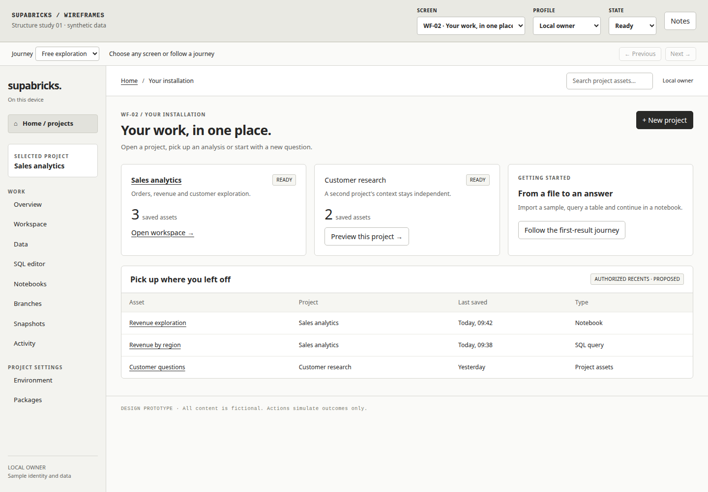
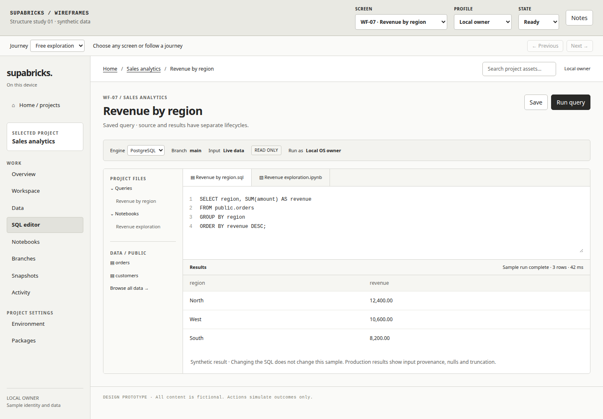

# Interactive console wireframes

[Product documentation](../README.md) · [Page structure](../page-structure.md) ·
[User flows](../user-flows.md)

Open [index.html](index.html) in a browser. The prototype has no build step,
external dependencies, CDN or backend. GitHub displays HTML source rather than
running it; use a local checkout or serve this directory:

```sh
python3 -m http.server 4174 --bind 127.0.0.1 --directory docs/wireframes
```

Then open `http://127.0.0.1:4174/`.

## Static previews

These captures show the same HTML prototype for readers reviewing on GitHub.
Use the interactive version to follow links, change profiles and inspect states.

Home and project entry:



SQL authoring and results:



## Review controls

The strip above the application is a design tool, not proposed product UI:

- **Screen** jumps to any of the 17 page compositions (WF-01–WF-17).
- **Profile** switches local-owner and governed-administrator examples. This
  merely changes the illustrated controls, not actual authorization.
- **State** shows ready, loading, empty, error or permission-denied layouts.
- **Notes** reveals the screen's purpose, linked flow IDs and design dependencies.
- **Journey** loads a suggested sequence; Previous/Next moves through its pages.

The application rail, breadcrumbs, asset links and handoff buttons are clickable.
Search filters synthetic assets. SQL and notebook controls simulate a run/save;
import and package flows show a sample review. Reviews and confirmations are
clearly marked as simulations. All values reset on reload; no files are read or
uploaded, and no requests reach the running Supabricks installation.

## Suggested walkthroughs

1. **First result:** Home → Project → Import → Table → SQL → Snapshots → Notebook.
2. **Shared data:** Data → Dataset detail → Publish/bind → Notebook → Activity.
3. **Governance:** Sign in → Access → Administration → Activity, in governed mode.
4. **Portable work:** Workspace → Packages → Environment → Notebook.

Try Empty on Home/Data, Error on Import/Activity and No access on a dataset or
administration page. Test narrow widths, keyboard navigation, Escape from dialogs
and browser Back/Forward. Some lifecycle states (revocation, unknown outcomes,
dirty-navigation guards) are specified in the page/flow documents rather than
fully simulated by this intentionally lightweight prototype.

The monochrome hierarchy, dashed placeholders and fixed sample data keep the
review focused on structure and task continuity. Colors, typography, final copy,
responsive authoring details and API integration are subsequent design work.
